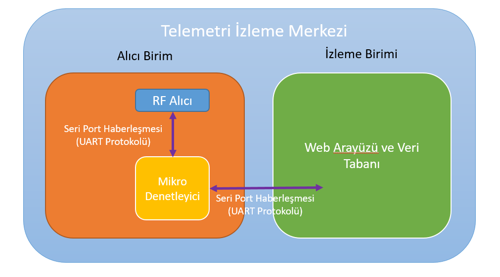
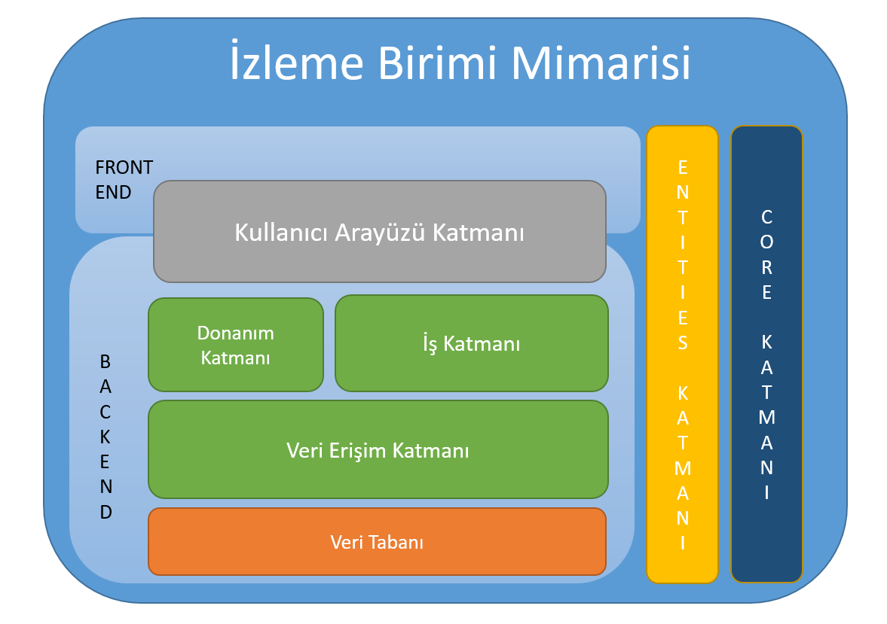
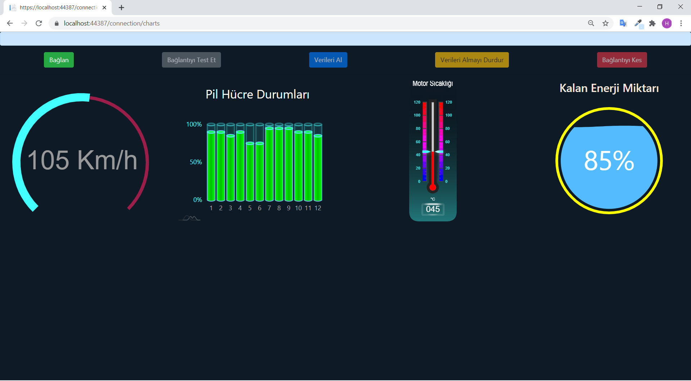

# Telemetry

Bu proje TUBİTAK Efficency Challenge Elektrikli Araba Yarışı kapsamında araç üzerindeki sensörlerden gelen verilerin arayüzde gösterilmesi ve kayıt altına alınması için 
geliştirilen telemetri sisteminin izleme merkezini kapsamaktadır.

# Sistemin Yapısı

# Yazılımın Mimarisi
  
 
 
 # Arayüz
 
 
 
 # Kullanılan Araçlar, Diller, Mimariler vs.
 
  - ASP.NET Core MVC
  - Entity Framework Core
  - MS SQL Server
  - SignalR
  - C#
  - JavaScript
  - Katmanlı Mimari
  - Arduino
   
  
 
